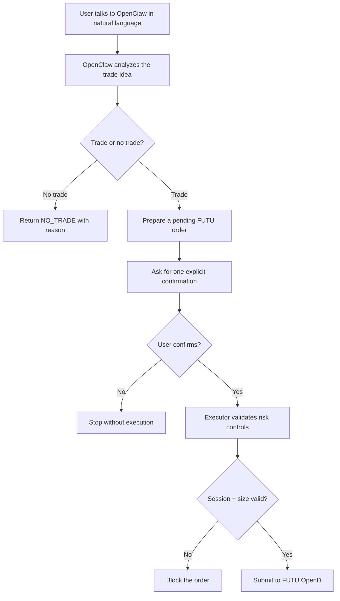

<div align="center">

# OpenClaw FUTU Trading

OpenClaw + FUTU OpenD integration for natural-language trade analysis, pending-order approval, and guarded order execution.

[](./LICENSE)


</div>

---

Use OpenClaw's built-in agent runtime for analysis and orchestration, then hand execution to FUTU OpenD. No separate multi-agent framework or extra agent API-key wiring is required for the trading flow itself, which makes this especially friendly for OpenClaw users who already rely on the platform's built-in model access.

For OpenAI subscription users already using OpenClaw, this means the trading workflow can reuse the agent capability you already have, instead of forcing you to wire up a separate trading-agent stack just to get started.

This repository packages two complementary pieces:
- `skill/`: a reusable OpenClaw skill for FUTU trading workflows
- `executor/`: a thin execution gateway that enforces risk controls before any order is sent to FUTU

## Why This Exists

Most trading assistants stop at analysis. This project closes the loop:
- let OpenClaw reason in natural language
- let OpenClaw prepare a pending order from that analysis
- require one explicit confirmation before execution
- keep hard risk controls in code, not only in prompts
- reuse OpenClaw's built-in agent capabilities instead of requiring a separate trading-agent API stack

## Core Features

- FUTU OpenD connectivity checks
- account, position, order, and quote inspection helpers
- natural-language trade proposal workflow
- pending-order approval before execution
- simulation-first defaults
- explicit REAL-order gating
- hard risk controls in the executor

Current built-in safeguards:
- max order size: `1 lot`, `1 contract`, or `1 share`
- after-hours, pre-market, auction, and closed-session execution blocked
- REAL execution requires an explicit confirmation string

## Workflow Overview



## Repo Layout

```text
openclaw-futu-trading/
├── skill/
│   ├── SKILL.md
│   ├── _meta.json
│   ├── agents/openai.yaml
│   ├── references/
│   └── scripts/
└── executor/
    ├── executor.py
    ├── workflow.py
    ├── prepare_trade.py
    ├── approve_latest_trade.py
    ├── run_openclaw_trade.py
    └── README.md
```

## Quick Start

Install dependencies:

```bash
pip install -r skill/requirements.txt
pip install -r executor/requirements.txt
```

Verify FUTU OpenD first:

```bash
python3 skill/scripts/futu_smoke_test.py --env SIMULATE
```

Run a dry-run preview through the executor:

```bash
python3 executor/executor.py --input-json '{"symbol":"HK.00001","side":"BUY","qty":1,"qty_unit":"LOT","price_mode":"ASK","market":"HK","env":"SIMULATE"}'
```

Prepare and approve a pending order:

```bash
python3 executor/prepare_trade.py \
  --symbol HK.00001 \
  --side BUY \
  --qty 1手 \
  --price 对手价 \
  --market 港股 \
  --env 模拟盘 \
  --remark demo \
  --thesis "Minimal test order"

python3 executor/approve_latest_trade.py
```

## OpenClaw Conversation Flow

This repository supports a direct conversation pattern:

1. User asks OpenClaw for a trade analysis.
2. OpenClaw decides whether the answer is `NO_TRADE` or a real proposal.
3. If it is a proposal, OpenClaw prepares a pending order.
4. OpenClaw asks for a single confirmation.
5. After the user confirms, OpenClaw executes the latest pending order.

For details, see:
- [`skill/SKILL.md`](./skill/SKILL.md)
- [`executor/README.md`](./executor/README.md)

## Demo Conversation

User:

```text
请分析腾讯控股是否适合做一笔最小测试交易。
如果不建议交易，直接告诉我原因。
如果建议交易，请直接生成待执行单并告诉我摘要，等我确认一次后再执行。
```

OpenClaw:

```text
已生成待执行单：
- 股票：HK.00001
- 操作：买入
- 数量：1手
- 环境：模拟盘
- 原因：短线结构改善，适合最小测试单

要我继续执行吗？
```

User:

```text
确认执行
```

OpenClaw:

```text
已执行最新模拟盘待执行单，并返回执行结果摘要。
```

## Publishing Notes

This repo intentionally excludes:
- local account IDs
- pending-order state
- private workspace files
- machine-specific absolute paths

Before enabling REAL execution in your own deployment, review the executor safeguards carefully and test on `SIMULATE` first.
